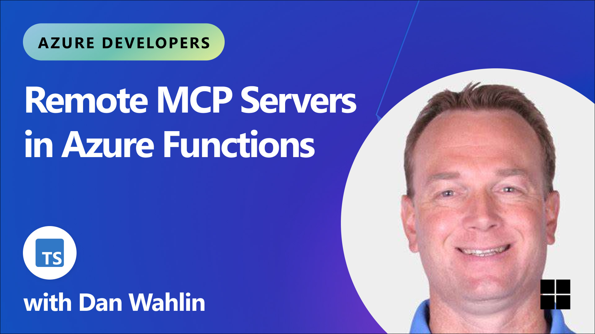

<!--
---
name: Remote MCP with Azure Functions (Node.js/TypeScript/JavaScript)
description: Run a remote MCP server on Azure functions.  
languages:
- typescript
- javascript
- nodejs
- bicep
- azdeveloper
products:
- azure-functions
- azure
page_type: sample
urlFragment: remote-mcp-functions-typescript
---
-->
# Getting Started with Remote MCP Servers using Azure Functions (Node.js/TypeScript)

This is a quickstart template to easily build and deploy a custom remote MCP server to the cloud using Azure functions. You can clone/restore/run on your local machine with debugging, and `azd up` to have it in the cloud in a couple minutes.  The MCP server is secured by design using keys and HTTPs, and allows more options for OAuth using EasyAuth and/or API Management as well as network isolation using VNET. 

**Watch the video overview**

<a href="https://www.youtube.com/watch?v=U9DsLcP5vEk">
  
</a>

If you're looking for this sample in more languages check out the [.NET/C#](https://github.com/Azure-Samples/remote-mcp-functions-dotnet) and [Python](https://github.com/Azure-Samples/remote-mcp-functions-python) versions.

[](https://codespaces.new/Azure-Samples/remote-mcp-functions-typescript)

Below is the architecture diagram for the Remote MCP Server using Azure Functions:


## Prerequisites

+ [Node.js](https://nodejs.org/en/download/) version 18 or higher
+ [Azure Functions Core Tools](https://learn.microsoft.com/azure/azure-functions/functions-run-local?pivots=programming-language-javascript#install-the-azure-functions-core-tools) >= `4.0.7030`
+ [Azure Developer CLI](https://aka.ms/azd)
+ To use Visual Studio Code to run and debug locally:
  + [Visual Studio Code](https://code.visualstudio.com/)
  + [Azure Functions extension](https://marketplace.visualstudio.com/items?itemName=ms-azuretools.vscode-azurefunctions)
+ [Docker](https://www.docker.com/) to run Azurite, the Azure Storage Emulator (optional)

## Prepare your local environment

An Azure Storage Emulator is needed for this particular sample because we will save and get snippets from blob storage. 

1. Start Azurite

    ```shell
    docker run -p 10000:10000 -p 10001:10001 -p 10002:10002 \
        mcr.microsoft.com/azure-storage/azurite
    ```

>**Note** if you use Azurite coming from VS Code extension you need to run `Azurite: Start` now or you will see errors.

## Run your MCP Server locally from the terminal

1. Install dependencies
   ```shell
   npm install
   ```

1. Build the project
   ```shell
   npm run build
   ```

1. Start the Functions host locally:
   ```shell
   func start
   ```

> **Note** by default this will use the webhooks route: `/runtime/webhooks/mcp`.  Later we will use this in Azure to set the key on client/host calls: `/runtime/webhooks/mcp?code=<system_key>`

## Use the *local* MCP server from within a client/host

### VS Code - Copilot Edits

1. **Add MCP Server** from command palette and add URL to your running Function app's mcp endpoint:
    ```shell
    http://0.0.0.0:7071/runtime/webhooks/mcp
    ```

1. Select **HTTP (Server-Sent-Events)** for the type of MCP server to add.
1. Enter the URL to your running function app's mcp endpoint
1. Enter the server ID. (This can be any name you want)
1. Choose if you want to run this in your User settings (available to all apps for you) or to your Workspace settings (available to this app, only)
1. **List MCP Servers** from command palette and start the server. The previous step may have already started your local server. If so, you can skip this step.
1. In Copilot chat agent mode enter a prompt to trigger the tool, e.g., select some code and enter this prompt

    ```plaintext
    Say Hello
    ```

    ```plaintext
    Save this snippet as snippet1 
    ```

    ```plaintext
    Retrieve snippet1 and apply to newFile.ts
    ```
1. When prompted to run the tool, consent by clicking **Continue**

1. When you're done, press Ctrl+C in the terminal window to stop the `func.exe` host process, and **List MCP Servers** from command palette and stop the local server.

### MCP Inspector

1. In a **new terminal window**, install and run MCP Inspector

    ```shell
    npx @modelcontextprotocol/inspector node build/index.js
    ```
    
1. If you stopped your function app previously, start the Functions host locally:

   ```shell
   func start
   ```

1. CTRL click to load the MCP Inspector web app from the URL displayed by the app (e.g. http://0.0.0.0:5173/#resources)
1. Set the transport type to `http` 
1. Set the URL to your running Function app's mcp endpoint and **Connect**:
    ```shell
    http://0.0.0.0:7071/runtime/webhooks/mcp
    ```
1. **List Tools**.  Click on a tool and **Run Tool**.  

1. When you're done, press Ctrl+C in the terminal window to stop the `func.exe` host process, and press Ctrl+C in the terminal window to stop the `@modelcontextprotocol/inspector` host process.

## Verify local blob storage in Azurite

After testing the snippet save functionality locally, you can verify that blobs are being stored correctly in your local Azurite storage emulator.

### Using Azure Storage Explorer

1. Open Azure Storage Explorer
1. In the left panel, expand **Emulator & Attached** → **Storage Accounts** → **(Emulator - Default Ports) (Key)**
1. Navigate to **Blob Containers** → **snippets**
1. You should see any saved snippets as blob files in this container
1. Double-click on any blob to view its contents and verify the snippet data was saved correctly

### Using Azure CLI (Alternative)

If you prefer using the command line, you can also verify blobs using Azure CLI with the storage emulator:

```shell
# List blobs in the snippets container
az storage blob list --container-name snippets --connection-string "DefaultEndpointsProtocol=http;AccountName=devstoreaccount1;AccountKey=Eby8vdM02xNOcqFlqUwJPLlmEtlCDXJ1OUzFT50uSRZ6IFsuFq2UVErCz4I6tq/K1SZFPTOtr/KBHBeksoGMGw==;BlobEndpoint=http://127.0.0.1:10000/devstoreaccount1;"
```

```shell
# Download a specific blob to view its contents
az storage blob download --container-name snippets --name <blob-name> --file <local-file-path> --connection-string "DefaultEndpointsProtocol=http;AccountName=devstoreaccount1;AccountKey=Eby8vdM02xNOcqFlqUwJPLlmEtlCDXJ1OUzFT50uSRZ6IFsuFq2UVErCz4I6tq/K1SZFPTOtr/KBHBeksoGMGw==;BlobEndpoint=http://127.0.0.1:10000/devstoreaccount1;"
```

This verification step ensures your MCP server is correctly interacting with the local storage emulator and that the blob storage functionality is working as expected before deploying to Azure.

## Deploy to Azure for Remote MCP

Optionally, you can opt-in to a VNet being used in the sample. (If you choose this, do this before `azd up`)

```bash
azd env set VNET_ENABLED true
```

Run these [azd](https://aka.ms/azd) commands to provision the function app, with any required Azure resources, and deploy your code:

```shell
azd provision
```

Wait a few minutes for access permissions to take effect, then run 

```shell
azd deploy
```

> **Note** [API Management](https://aka.ms/mcp-remote-apim-auth) can be used for improved security and policies over your MCP Server, and [App Service built-in authentication](https://learn.microsoft.com/en-us/azure/app-service/overview-authentication-authorization) can be used to set up your favorite OAuth provider including Entra.  

## Connect to your *remote* MCP server function app from a client

Your client will need a key in order to invoke the new hosted SSE endpoint, which will be of the form `https://<funcappname>.azurewebsites.net/runtime/webhooks/mcp`. The hosted function requires a system key by default which can be obtained from the [portal](https://learn.microsoft.com/en-us/azure/azure-functions/function-keys-how-to?tabs=azure-portal) or the CLI (`az functionapp keys list --resource-group <resource_group> --name <function_app_name>`). Obtain the system key named `mcp_extension`.

### Connect to remote MCP server in MCP Inspector
For MCP Inspector, you can include the key in the URL: 
```plaintext
https://<funcappname>.azurewebsites.net/runtime/webhooks/mcp?code=<your-mcp-extension-system-key>
```

### Connect to remote MCP server in VS Code - GitHub Copilot
For GitHub Copilot within VS Code, you should set the key as the `x-functions-key` header in `mcp.json`, and you would use `https://<funcappname>.azurewebsites.net/runtime/webhooks/mcp` for the URL. The following example is from the `mcp.json` file included in this repository and uses an input to prompt you to provide the key when you start the server from VS Code.  Your `mcp.json` file looks like this:

```json
{
    "inputs": [
        {
            "type": "promptString",
            "id": "functions-mcp-extension-system-key",
            "description": "Azure Functions MCP Extension System Key",
            "password": true
        },
        {
            "type": "promptString",
            "id": "functionapp-name",
            "description": "Azure Functions App Name"
        }
    ],
    "servers": {
        "remote-mcp-function": {
            "type": "http",
            "url": "https://${input:functionapp-name}.azurewebsites.net/runtime/webhooks/mcp",
            "headers": {
                "x-functions-key": "${input:functions-mcp-extension-system-key}"
            }
        },
        "local-mcp-function": {
            "type": "http",
            "url": "http://0.0.0.0:7071/runtime/webhooks/mcp"
        }
    }
}
```

1. Click Start on the server `remote-mcp-function`, inside the `mcp.json` file:

1. Enter the name of the function app that you created in the Azure Portal, when prompted by VS Code.

1. Enter the `Azure Functions MCP Extension System Key` into the prompt. You can copy this from the Azure portal for your function app by going to the Functions menu item, then App Keys, and copying the `mcp_extension` key from the System Keys.

1. In Copilot chat agent mode enter a prompt to trigger the tool, e.g., select some code and enter this prompt

    ```plaintext
    Say Hello
    ```

    ```plaintext
    Save this snippet as snippet1 
    ```

    ```plaintext
    Retrieve snippet1 and apply to newFile.ts
    ```

## Redeploy your code

You can run the `azd deploy` command as many times as you need to deploy code updates to your function app.

>[!NOTE]
>Deployed code files are always overwritten by the latest deployment package.

## Clean up resources

When you're done working with your function app and related resources, you can use this command to delete the function app and its related resources from Azure and avoid incurring any further costs:

```shell
azd down
```

## Source Code

The function code for the `getSnippet` and `saveSnippet` endpoints are defined in the TypeScript files in the `src` directory. The MCP function annotations expose these functions as MCP Server tools.

This shows the code for a few MCP server examples (get string, get object, save object):

```typescript
// Hello function - responds with hello message
export async function mcpToolHello(context: InvocationContext): Promise<string> {
    return "Hello I am MCP Tool!";
}

// Register the hello tool
app.mcpTool('hello', {
    toolName: 'hello',
    description: 'Simple hello world MCP Tool that responses with a hello message.',
    handler: mcpToolHello
});

// GetSnippet function - retrieves a snippet by name
export async function getSnippet(_message: unknown, context: InvocationContext): Promise<string> {
    console.info('Getting snippet');
    
    // Get snippet name from the tool arguments
    const mcptoolargs = context.triggerMetadata.mcptoolargs as { snippetname?: string };
    const snippetName = mcptoolargs?.snippetname;

    console.info(`Snippet name: ${snippetName}`);
    
    if (!snippetName) {
        return "No snippet name provided";
    }
    
    // Get the content from blob binding - properly retrieving from extraInputs
    const snippetContent = context.extraInputs.get(blobInputBinding);
    
    if (!snippetContent) {
        return `Snippet '${snippetName}' not found`;
    }
    
    console.info(`Retrieved snippet: ${snippetName}`);
    return snippetContent as string;
}


// Register the GetSnippet tool
app.mcpTool('getsnippet', {
    toolName: GET_SNIPPET_TOOL_NAME,
    description: GET_SNIPPET_TOOL_DESCRIPTION,
    toolProperties: [
        {
            propertyName: SNIPPET_NAME_PROPERTY_NAME,
            propertyValue: PROPERTY_TYPE,
            description: SNIPPET_NAME_PROPERTY_DESCRIPTION,
        }
    ],
    extraInputs: [blobInputBinding],
    handler: getSnippet
});

// SaveSnippet function - saves a snippet with a name
export async function saveSnippet(_message: unknown, context: InvocationContext): Promise<string> {
    console.info('Saving snippet');
    
    // Get snippet name and content from the tool arguments
    const mcptoolargs = context.triggerMetadata.mcptoolargs as { 
        snippetname?: string;
        snippet?: string;
    };
    
    const snippetName = mcptoolargs?.snippetname;
    const snippet = mcptoolargs?.snippet;
    
    if (!snippetName) {
        return "No snippet name provided";
    }
    
    if (!snippet) {
        return "No snippet content provided";
    }
    
    // Save the snippet to blob storage using the output binding
    context.extraOutputs.set(blobOutputBinding, snippet);
    
    console.info(`Saved snippet: ${snippetName}`);
    return snippet;
}

// Register the SaveSnippet tool
app.mcpTool('savesnippet', {
    toolName: SAVE_SNIPPET_TOOL_NAME,
    description: SAVE_SNIPPET_TOOL_DESCRIPTION,
    toolProperties: [
        {
            propertyName: SNIPPET_NAME_PROPERTY_NAME,
            propertyValue: PROPERTY_TYPE,
            description: SNIPPET_NAME_PROPERTY_DESCRIPTION,
        },
        {
            propertyName: SNIPPET_PROPERTY_NAME,
            propertyValue: PROPERTY_TYPE,
            description: SNIPPET_PROPERTY_DESCRIPTION,
        }
    ],
    extraOutputs: [blobOutputBinding],
    handler: saveSnippet
});
```

Note that the `host.json` file also includes a reference to the extension bundle, which is required for apps using this feature:

```json
"extensionBundle": {
  "id": "Microsoft.Azure.Functions.ExtensionBundle",
  "version": "[4.*, 5.0.0)"
}
```

## Next Steps

- Add [API Management](https://aka.ms/mcp-remote-apim-auth) to your MCP server (auth, gateway, policies, more!)
- Add [built-in auth](https://learn.microsoft.com/en-us/azure/app-service/overview-authentication-authorization) to your MCP server
- Enable VNET using VNET_ENABLED=true flag
- Learn more about [related MCP efforts from Microsoft](https://github.com/microsoft/mcp/tree/main/Resources)

